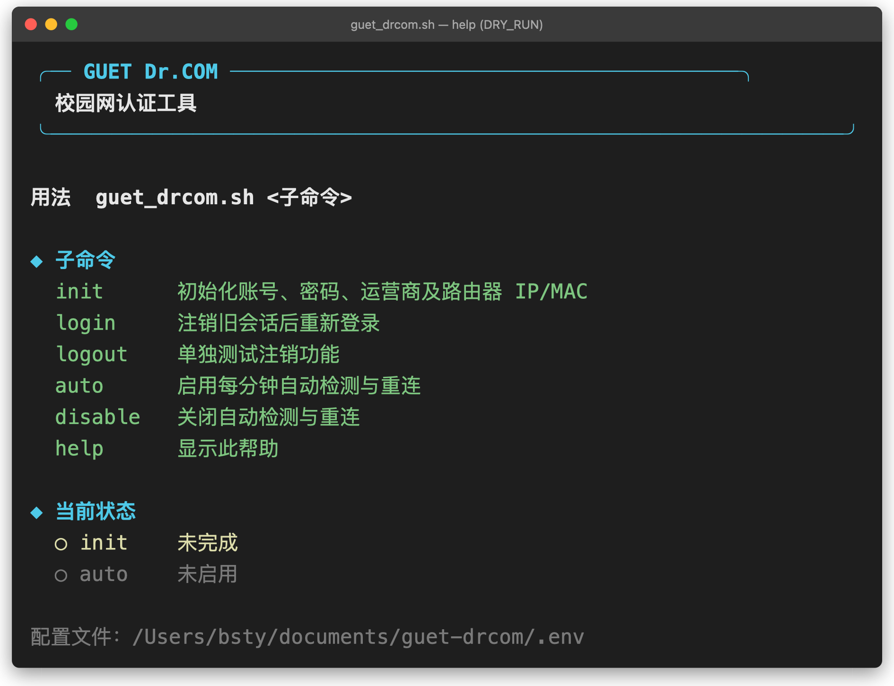
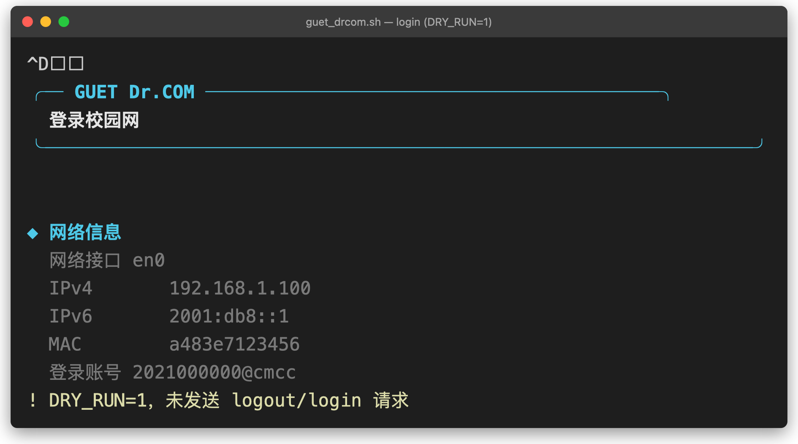
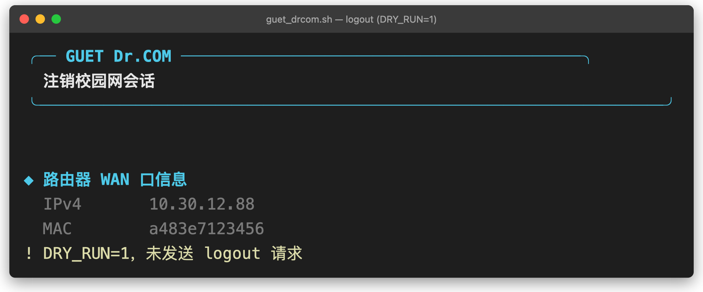
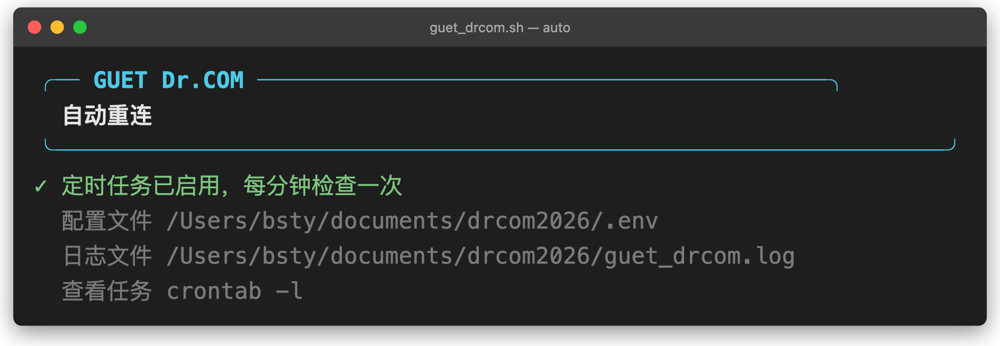

# GUET Dr.COM 校园网认证工具

桂林电子科技大学（GUET）校园网 Dr.COM 认证辅助脚本，支持自动登录、掉线检测与自动重连，覆盖 macOS/Linux 与 Windows。

- **`guet_drcom.sh`** — macOS / Linux（bash），用 crontab 保活。
- **`guet_drcom.ps1`** — Windows（PowerShell），用「计划任务」保活。
- **`guet_drcom.bat`** — Windows 启动器：双击出菜单，免敲参数。

两个版本认证流程一致，按平台选其一即可。

---

## 运行示例

以下为脚本运行的终端输出截图（macOS 终端风格）。

> 说明：截图均以 `DRY_RUN=1`（干跑）模式生成，仅展示交互与输出格式，**不真实发送任何认证请求**；网络信息、账号均为模拟值。实际运行去掉 `DRY_RUN` 即可正常登录。

<table>
<tr>
<td><b><code>./guet_drcom.sh help</code></b><br>查看帮助与当前状态<br></td>
<td><b><code>DRY_RUN=1 ./guet_drcom.sh login</code></b><br>登录流程（干跑，不发请求）<br></td>
</tr>
<tr>
<td><b><code>DRY_RUN=1 ./guet_drcom.sh logout</code></b><br>单独注销（干跑，不发请求）<br></td>
<td><b><code>./guet_drcom.sh auto</code></b><br>启用每分钟自动检测与重连<br></td>
</tr>
</table>

---

## 快速开始

### macOS / Linux

在脚本目录下：

```bash
./guet_drcom.sh init      # 初始化：填学号、密码、选运营商
./guet_drcom.sh login     # 登录
./guet_drcom.sh auto      # 开启每分钟自动检测与重连（推荐）
./guet_drcom.sh disable   # 关闭自动重连
./guet_drcom.sh help      # 查看帮助与状态
```

### Windows

**方式一（推荐）**：双击 `guet_drcom.bat`，按菜单数字选择。

**方式二**：在脚本目录打开 PowerShell：

```powershell
powershell -ExecutionPolicy Bypass -File .\guet_drcom.ps1 init
powershell -ExecutionPolicy Bypass -File .\guet_drcom.ps1 login
powershell -ExecutionPolicy Bypass -File .\guet_drcom.ps1 auto
```

> 若已设为允许本地脚本（`Set-ExecutionPolicy -Scope CurrentUser RemoteSigned`），可直接 `.\guet_drcom.ps1 login`。

---

## 命令一览

| 命令 | 作用 |
|------|------|
| `init` | 交互式录入学号、密码、运营商，生成配置文件 |
| `login` | 注销旧会话后重新登录 |
| `logout` | 单独注销 |
| `auto` | 注册定时任务，每分钟检测掉线并自动重连 |
| `disable` | 移除自动重连任务 |
| `check` | 检测是否在线，掉线则自动登录（供定时任务调用） |
| `help` | 显示帮助与当前状态 |

## 运营商

`init` 时用 ↑/↓ 或数字 1–5 选择，决定账号后缀：

| 选项 | 运营商 | 账号后缀 |
|------|--------|----------|
| 1 | 校园网 | （无） |
| 2 | 中国移动 | `@cmcc` |
| 3 | 中国联通 | `@unicom` |
| 4 | 中国电信 | `@telecom` |
| 5 | 中国广电 | `@glgd` |

---

## 注意事项

> **安全提示**：bash 版密码以明文存在 `.env`，务必 `chmod 600` 限本人访问；Windows 版用 DPAPI 加密，配置文件绑定本机当前用户，换用户或换电脑需重新 `init`。

> 提示：Windows 版计划任务经 `wscript.exe` 隐藏启动，部分杀毒软件可能拦截；若 `auto` 启用后日志长期无新内容，可检查安全软件是否拦截了 `wscript.exe` 或删除了 `guet_drcom_hidden.vbs`。

## 环境变量（可选）

以下变量可覆盖默认值，两平台一致：

`SERVER_IP`、`STATUS_URL`、`LOGIN_URL`、`LOGOUT_URL`、`LOGOUT_DELAY`、`DRY_RUN`、`AUTO_LOG`、`GUET_DRCOM_ENV`（配置文件路径），以及 `INTERFACE`/`CLIENT_IP`/`CLIENT_IPV6`/`CLIENT_MAC`（手动指定网络信息）。

```powershell
# 示例：只探测网络、不真正发请求
$env:DRY_RUN = '1'; .\guet_drcom.ps1 login
```

---

## 卸载

macOS / Linux：

```bash
./guet_drcom.sh disable        # 移除 crontab
rm -f .env guet_drcom.log      # 删除配置与日志
```

Windows：双击 `guet_drcom.bat` 选 disable，或运行：

```powershell
powershell -ExecutionPolicy Bypass -File .\guet_drcom.ps1 disable
```

然后删除 `guet_drcom.config.json` 与日志即可。

---

## 支持作者

如果这个工具帮到了你，欢迎给项目点个 ⭐ Star，或请作者喝杯咖啡 ☕


本工具免费开源，你的支持是我持续维护的动力。

---

## 许可证

本项目采用 [MIT License](LICENSE) 许可。

## 关于作者

本工具代码风格严格遵循 Andrej Karpathy 编码规范（极简主义），追求清晰、简洁、易维护。

**原作者**：bbbstyyy
