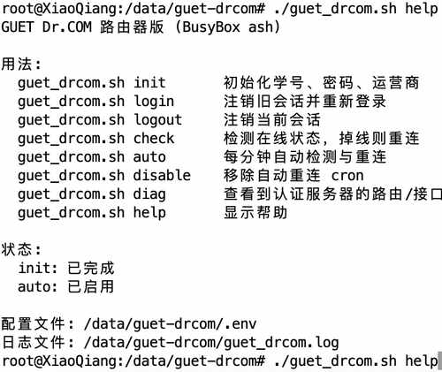

# GUET Dr.COM · ZTE 光猫版

桂林电子科技大学（GUET）校园网 Dr.COM 认证脚本，基于 miwifi 分支适配 **ZTE ONU / 光猫上的老版本 BusyBox ash**。

本分支不需要 Bash，也不依赖 `iconv`，并额外避免了部分 ZTE 老 BusyBox 中缺失的 `dirname` 与 `command -v`。脚本会从设备自身的路由表中自动识别通往认证服务器的 WAN 接口、IPv4 和 MAC，并支持掉线检测与 cron 自动重连。

> ZTE 兼容目标：BusyBox ash 1.17.x 一类老固件环境；已针对缺失 `dirname`、缺失 `command` builtin 的情况做兼容。

---

## 该选哪个分支？

| 分支 | 脚本运行位置 | 网络信息来源 | 适用场景 |
| --- | --- | --- | --- |
| [`main`](https://github.com/bbbstyyy/guet-drcom/tree/main) | 电脑 | 自动读取电脑网卡 | 电脑直接接入校园网 |
| [`router`](https://github.com/bbbstyyy/guet-drcom/tree/router) | 电脑 | 手动填写路由器 WAN IP / MAC | 电脑在路由器 LAN 后面，但认证脚本仍跑在电脑上 |
| **`miwifi`** | **路由器** | **自动读取路由器 WAN 接口 / IP / MAC** | **小米路由器自身完成校园网认证** |

如果你的 SSH 提示符类似：

```text
root@XiaoQiang:~#
```

并希望让路由器自己保持 Dr.COM 在线，使用本分支。

---

## 运行效果

```sh
./guet_drcom.sh help
```



---

## 环境要求

脚本以 `/bin/sh` 运行，面向 BusyBox ash / OpenWrt-like 固件。

运行认证功能需要：

- `curl`
- `ip`
- `awk`
- `grep`
- `sed`
- `tr`

启用自动重连还需要：

- `crontab`
- `crond`

不需要：

- Bash
- `iconv`

可先检查环境：

```sh
for cmd in curl ip awk grep sed tr crontab crond; do
    printf '%-10s : ' "$cmd"
    command -v "$cmd" 2>/dev/null || echo MISSING
done
```

---

## 安装

建议安装到 ZTE 光猫的**持久化 JFFS2 目录**。如果 `mount` 中能看到 `/usercfg` 为 `jffs2 (rw,...)`，推荐使用：

```text
/usercfg/guet-drcom
```

安装：

```sh
mkdir -p /usercfg/guet-drcom
cd /usercfg/guet-drcom

curl -fL \
  https://raw.githubusercontent.com/bbbstyyy/guet-drcom/miwifi/guet_drcom.sh \
  -o guet_drcom.sh

chmod 700 guet_drcom.sh
./guet_drcom.sh help
```

> 不建议长期放在 `/tmp`、`/var` 等 tmpfs 目录，因为重启后文件会消失。

---

## 快速开始

### 1. 初始化

```sh
cd /usercfg/guet-drcom
./guet_drcom.sh init
```

按提示输入：

1. 学号
2. 密码
3. 运营商

运营商对应关系：

| 选项 | 运营商 | 账号后缀 |
| ---: | --- | --- |
| 1 | 校园网 | 无 |
| 2 | 中国移动 | `@cmcc` |
| 3 | 中国联通 | `@unicom` |
| 4 | 中国电信 | `@telecom` |
| 5 | 中国广电 | `@glgd` |

初始化后生成：

```text
/usercfg/guet-drcom/.env
```

配置文件权限会设置为 `600`。

### 2. 检查路由

首次使用建议先执行：

```sh
./guet_drcom.sh diag
```

正常情况下，应能看到到认证服务器 `10.0.1.5` 的路由，例如：

```text
10.0.1.5 via 10.60.83.254 dev eth0 src 10.60.81.144
```

其中：

- `dev eth0`：路由器实际用于校园网认证的接口
- `src 10.x.x.x`：校园网分配给路由器的 IPv4

如果出现：

```text
RTNETLINK answers: Network unreachable
```

说明当前路由器还没有到认证服务器的 IPv4 路由。先检查 WAN 是否已经接入校园网并正确获得地址。

### 3. 登录

```sh
./guet_drcom.sh login
```

脚本会：

1. 自动获取通往 `10.0.1.5` 的接口
2. 获取该接口的 IPv4 / IPv6 / MAC
3. 尝试注销旧会话
4. 提交新的 Dr.COM 登录认证

登录成功时服务器返回中会包含：

```text
"result":1
```

并显示：

```text
登录成功
```

> 注销阶段如果出现 `Radius注销失败！` 或 `result=0`，通常只是当前没有可注销的旧 Radius 会话。只要随后登录返回 `result=1`，认证就是成功的。

### 4. 检测在线状态

```sh
./guet_drcom.sh check
echo $?
```

行为：

- 在线：直接返回 `0`
- 掉线：自动重新登录
- 当前无法路由到 `10.0.1.5`：跳过认证并返回非零状态

在线检测同时兼容门户页面中的 UTF-8 / GBK “注销页”标记，因此无需安装 `iconv`。

### 5. 开启自动重连

```sh
./guet_drcom.sh auto
```

脚本会保留路由器已有的 cron 项，只添加自己的任务：

```text
# guet_drcom-auto
```

默认每分钟执行一次在线检测。

查看任务：

```sh
crontab -l | grep guet_drcom
```

查看日志：

```sh
tail -f /usercfg/guet-drcom/guet_drcom.log
```

### 6. 关闭自动重连

```sh
./guet_drcom.sh disable
```

只移除带 `# guet_drcom-auto` 标记的任务，不修改路由器原有的其他 cron 项。

---

## 命令一览

| 命令 | 作用 |
| --- | --- |
| `init` | 初始化学号、密码和运营商 |
| `login` | 自动获取 WAN 网络信息，注销旧会话后重新登录 |
| `logout` | 注销当前会话 |
| `check` | 检查在线状态，掉线时自动登录 |
| `auto` | 添加每分钟执行一次的自动检测 / 重连 cron |
| `disable` | 删除本脚本添加的自动重连 cron |
| `diag` | 显示到认证服务器的路由、默认路由和 IPv4 地址 |
| `help` | 显示帮助与当前状态 |

---

## 文件

本分支只保留设备运行所需内容：

```text
.
├── README.md
├── guet_drcom.sh
└── docs
    └── help.jpg
```

运行后还会在脚本目录产生：

| 文件 | 说明 |
| --- | --- |
| `.env` | 认证账号和密码配置 |
| `guet_drcom.log` | `auto` / `check` 的日志 |

---

## 可选环境变量

可在执行命令前覆盖部分默认值：

| 变量 | 默认值 / 作用 |
| --- | --- |
| `SERVER_IP` | `10.0.1.5` |
| `STATUS_URL` | 在线状态页面 |
| `LOGIN_URL` | 登录接口 |
| `LOGOUT_URL` | 注销接口 |
| `LOGOUT_DELAY` | 注销后到登录前的等待时间，默认 1 秒 |
| `DRY_RUN` | 设为 `1` 时只检测网络信息，不发送登录 / 注销请求 |
| `AUTO_LOG` | 自动重连日志路径 |
| `GUET_DRCOM_ENV` | 自定义配置文件路径 |
| `INTERFACE` | 手动覆盖自动检测到的接口 |
| `CLIENT_IP` | 手动覆盖 IPv4 |
| `CLIENT_IPV6` | 手动覆盖 IPv6 |
| `CLIENT_MAC` | 手动覆盖 MAC |

例如只检查脚本识别到的网络信息：

```sh
DRY_RUN=1 ./guet_drcom.sh login
```

---

## 更新脚本

在安装目录重新下载即可：

```sh
cd /usercfg/guet-drcom

curl -fL \
  https://raw.githubusercontent.com/bbbstyyy/guet-drcom/miwifi/guet_drcom.sh \
  -o guet_drcom.sh

chmod 700 guet_drcom.sh
```

已有的 `.env` 不会被覆盖。

---

## 卸载

先移除自动任务：

```sh
./guet_drcom.sh disable
```

再删除文件：

```sh
cd /data
rm -rf /usercfg/guet-drcom
```

---

## 安全提示

`.env` 中的校园网密码以明文保存在路由器本地。

请注意：

- 不要把 `.env` 上传到 GitHub
- 不要把配置文件发送给他人
- 不要把包含真实账号、密码的日志或终端截图公开
- 建议只允许 `root` 访问脚本目录和配置文件

---

## 与 `router` 分支的区别

这两个分支名字容易混淆：

**`router` 分支**：

```text
校园网 → 路由器 → 电脑
                  ↑
               脚本运行
```

脚本运行在电脑上，因此需要手动填写路由器 WAN 的 IPv4 和 MAC。

**`miwifi` 分支**：

```text
校园网 → 小米路由器
             ↑
          脚本运行
```

脚本直接运行在路由器上，所以会自动读取路由器自身的 WAN 路由、IPv4 和 MAC，不需要手动填写 WAN 信息。

---

**原作者：bbbstyyy**


---

## ZTE BusyBox 兼容说明

部分 ZTE ONU 固件使用较老的 BusyBox。已确认可能存在以下差异：

- `/bin/sh -> /bin/busybox`
- 支持 `ash`
- 缺少 `dirname` applet
- `command -v` 不可用，但 `type` 可用

因此本分支：

- 使用 shell 参数展开计算脚本目录，不依赖 `dirname`
- 使用 `type` 检测命令，不依赖 `command -v`
- 默认建议将脚本和 `.env` 放在 `/usercfg/guet-drcom`
- 建议将自动重连日志放在 `/tmp/guet_drcom.log`，避免频繁写 Flash

在 ZTE 上启用自动重连前，请先确认 `crontab` / `crond` 是否存在，以及 cron 配置是否会跨重启保留。
